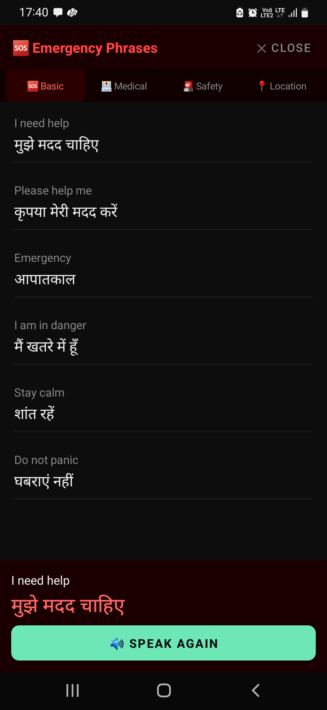

# BhashaBridge V4

Offline English ↔ Hindi speech translation for Android. Everything — recognition, translation and
speech — runs on the device. The app requests no network permission.

Built for the **Arm AI Optimization Challenge**. The engineering story is the runtime: a
transformer decoder that shipped with no KV cache was re-exported, quantized, tuned and made
capability-aware, and every step is backed by on-device measurements from the same phone.

| | |
|---|---|
|  |  |

## What it does

- **Type or speak** English, get Hindi (both directions in the UI; see *Known limitations*).
- **Live speech**: Vosk recognition with a running waveform and streaming translation of partial
  results, then spoken output through the system TTS voice.
- **Emergency phrases**: 32 human-translated pairs across four categories, instant, no model on the
  path — for the case where a translation must be right and immediate.
- **Audio import**: transcribe and translate a recorded file.
- **History**, **app language** (English / हिंदी), and a **Model & device** panel that reports the
  detected CPU and the ORT policy derived from it.

## Measured performance

SM-M315F (Exynos 9611, 4×Cortex-A73 + 4×Cortex-A53, Armv8.0-A, Android 12) — the device every
number in this repo was measured on.

| | |
|---|---|
| Translation, 6 tokens | 461 ms end-to-end from the UI |
| Translation, 12 tokens | 667 ms median, p95 686 ms |
| KV-cache speedup | 1.06× @2 tokens → **2.12× @12 tokens** |
| Model size | 1869 MB fp32 → **472 MB INT8** (3.96×) |
| Process memory | ~605–670 MB PSS steady state |

Full evidence: [`docs/OPTIMIZATION_SUMMARY.md`](docs/OPTIMIZATION_SUMMARY.md).

## Build

```bash
export JAVA_HOME="/path/to/Android Studio/jbr"
./gradlew assembleDebug          # or installDebug with a device attached
```

Requires Android SDK 36, JDK 17, and a device or emulator on API 24+.

**Model assets are not in git** (~610 MB). `app/src/main/assets/` must contain:

| Asset | Source |
|---|---|
| `encoder_int8.onnx`, `decoder_init_int8.onnx`, `decoder_step_int8.onnx` | produced by `model_pipeline/cached_export.py` + `quantize_cached.py` |
| `dict.SRC.json`, `dict.TGT.json`, `dict.SRC_HI.json`, `dict.TGT_EN.json` | IndicTrans2 vocabularies |
| `model/`, `model-hi/` | Vosk small English (Indian) and Hindi models |

Regenerating the ONNX graphs is documented in
[`model_pipeline/EXPORT_WITH_CACHE.md`](model_pipeline/EXPORT_WITH_CACHE.md).

## Architecture

```
MainActivity / WelcomeActivity      renders state, forwards taps
        ▼
TranslateViewModel                  owns direction, translation, speech, history
        ▼
BhashaBridgeApp                     process-scoped owner of every native resource
        ▼
MtEngine → encoder / decoder_init / decoder_step   (INT8, KV-cached, ONNX Runtime)
```

No Activity can reach the runtime; native resources are owned once, at process scope, with a single
release trigger. The rules are written down and enforced, not assumed —
[`docs/ARCHITECTURE_RULES.md`](docs/ARCHITECTURE_RULES.md),
[`docs/DEPENDENCY_RULES.md`](docs/DEPENDENCY_RULES.md),
[`docs/CODING_STANDARDS.md`](docs/CODING_STANDARDS.md).

## Documentation

| Document | What it covers |
|---|---|
| [OPTIMIZATION_SUMMARY](docs/OPTIMIZATION_SUMMARY.md) | The submission's technical report: every optimisation, kept and reverted |
| [KV_CACHE_RUNTIME](docs/KV_CACHE_RUNTIME.md) | How the cached decoder runs on device |
| [CACHE_BENCHMARK](docs/CACHE_BENCHMARK.md) | Cached vs uncached, measured |
| [ORT_TUNING](docs/ORT_TUNING.md) | One-variable-at-a-time SessionOptions sweep |
| [ARM_PLATFORM_OPTIMIZATION](docs/ARM_PLATFORM_OPTIMIZATION.md) | CPU detection and the policy derived from it |
| [UI_RECONSTRUCTION](docs/UI_RECONSTRUCTION.md) | The presentation layer, and what deviates from v3.4.1 |
| [VALIDATION_REPORT](docs/VALIDATION_REPORT.md) | Functional and performance validation results |
| [JUDGE_SCORECARD](docs/JUDGE_SCORECARD.md) | Self-assessment against the challenge criteria |
| [LESSONS_FROM_V3](docs/LESSONS_FROM_V3.md) | What the previous version got wrong, and why V4 is shaped this way |

## Known limitations

- **Hindi → English is not available in this build.** Only the EN→HI cached INT8 graphs have been
  exported; the UI reports the gap rather than failing. Hindi *recognition* works.
- **First launch takes ~27 s** to load the three ONNX sessions, behind a progress screen.
- **Portrait only in practice** — the layout does not adapt to landscape.
- **Release builds are unsigned and R8 is disabled.** See `docs/VALIDATION_REPORT.md` §5.

## Licence and attribution

This project's own source is available under the MIT licence. Bundled and depended-on components
keep their own licences — see [THIRD_PARTY_NOTICES.md](THIRD_PARTY_NOTICES.md).
